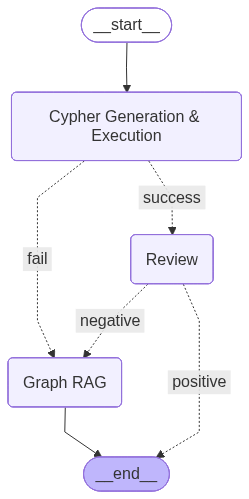
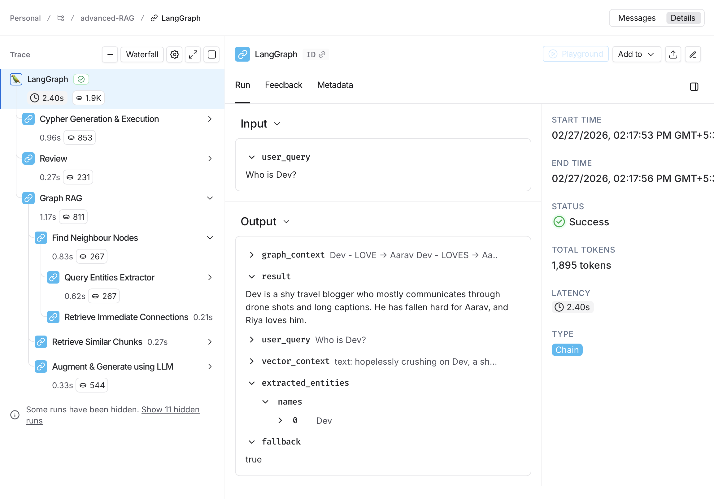

# Advanced-Graph-RAG
An Advanced Retrieval-Augmented Generation (RAG) system powered by a Knowledge Graph + Neo4j + Cypher-based retrieval + Review loop architecture.


This project:

- Converts unstructured data into a Knowledge Graph using a Cloud LLM  
- Loads the graph into Neo4j AuraDB  
- Generates and executes Cypher queries using an LLM  
- Applies fallback strategies
- Review & validation loop
- Combines:
  - User query entity extraction  
  - Neighbour node traversal  
  - Vector similarity search
- ✅ Workflow orchestration using LangGraph
- ✅ Tracing & observability using LangSmith

---

## Architecture Flow

The entire pipeline is implemented as a structured graph workflow using LangGraph.

User Query  
→ Cypher Generation (LLM)  
→ Cypher Execution (Neo4j)  
→ Review  
&nbsp;&nbsp;&nbsp;&nbsp;• If valid → Final Answer  
&nbsp;&nbsp;&nbsp;&nbsp;• If invalid → Graph RAG → Final Answer  
→ If Cypher fails → Graph RAG → Final Answer  



---

## Setup

### 1️⃣ Install Dependencies

```bash
pip install -r requirements.txt
```

### 2️⃣ Set Environment Variables

Create a `.env` file in the root directory:

```
# Cloud LLM API Key
GROQ_API_KEY=your_groq_api_key  # Provide your cloud provider's API key

# Neo4j Credentials
NEO4J_URI=neo4j+s://<...>.neo4j.io
NEO4J_USERNAME=neo4j
NEO4J_PASSWORD=your_password

# LangSmith Tracing (Optional)
LANGSMITH_API_KEY=your_langsmith_api_key
```

---

## Steps to Run

### 1️⃣ Create Knowledge Graph
Run:
```bash
python 1_knowledge_graph_conversion_using_cloud_llm.py
```
This generates: graph.pkl

### 2️⃣ Load Graph into Neo4j Aura DB
Open and run:
```
2_load_graph_to_neo4j.ipynb
```
This loads nodes and relationships into Neo4j.

### 3️⃣ Run Advanced Graph RAG
Open and run:
```
3_advanced_graph_rag.ipynb
```

---

## 🔍 Tracing & Observability (LangSmith)

Tracing is powered by **LangSmith**, enabling full visibility into the **LangGraph** workflow.

With tracing enabled, you can:

- 🔎 See the exact execution path (Cypher → Review → Fallback)  
- 📊 Track token usage per LLM call  
- ⏱ Measure latency at each step  
- 🔁 Inspect retries and validation loops  

### 🔬 LangSmith Trace Screenshot



---

## Notes

- `graph.pkl` is required for Step 2 and Step 3.
- Ensure Neo4j is running before executing notebooks.
- The current implementation uses **OpenAI GPT-OSS-20B via Groq Provider**. You can replace it with any LLM provider (OpenAI, Azure, Anthropic, etc.) as per your requirements.  

---

